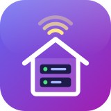

<p align="center">
  
</p>

<h1 align="center">homebase</h1>

A CLI for running local dev servers on macOS. Each server is a per-user
launchd agent, and a small reverse proxy makes it available at
`http://<name>.localhost`.

## Install

With [Homebrew](https://brew.sh):

```sh
brew install semenov/tap/homebase
homebase proxy install            # one-time: proxy on :80 as a launch agent
```

After `brew upgrade homebase`, run `homebase proxy install` again so the
proxy restarts on the new version.

From source: `go install github.com/semenov/homebase@latest`.

## Usage

```sh
cd ~/Dev/my-app
homebase add -- npm run dev -- --port '$PORT'   # registers "my-app", named after the folder
homebase start
homebase open                                   # http://my-app.localhost
homebase logs -f
homebase stop
homebase ls                                     # all servers
```

Inside a project folder, or any of its subfolders, commands act on that folder's server.
From anywhere else, pass the name: `homebase start my-app`. Use `homebase add api -- …`
to pick a name yourself, for example when one folder has several servers. In that case
the other commands also need the name.

## How it works

- **Config.** Servers are listed in `~/.config/homebase/servers.yaml`
  (`$HOMEBASE_CONFIG` overrides the path). Edit it with `homebase edit` or by hand.
- **Running a server.** Each server becomes `~/Library/LaunchAgents/dev.homebase.server.<name>.plist`.
  It runs `zsh -lc "<command>"` in its directory, so your normal PATH (nvm, brew) works.
  The port is passed in `$PORT`. If you don't pick one, homebase uses the first free port from 4000.
- **Crashes and reboots.** launchd restarts a server if it crashes.
  `start` enables the job and `stop` disables it, so after a reboot or login,
  servers that were running come back and stopped ones stay stopped.
- **Logs.** Output goes to `~/Library/Logs/homebase/<name>.log`.
- **Applying changes.** After changing a server's settings, run `homebase restart <name>`.
  This rewrites the plist and reloads the job.

## For AI agents

`homebase agents` prints a guide written for coding agents such as Claude Code or Codex.
It covers the workflow, the rules, and the JSON fields. Two features exist mainly for scripts and agents:

- **`homebase start <name> --wait`** waits until the server accepts connections.
  If the server crashes, exits, or times out, it exits non-zero and prints the log output since the start.
- **`homebase ls --json`** reports each server's state, pid, port, whether the port is listening,
  its URLs, and its log path.

To get agents to use homebase in your projects, add this to `CLAUDE.md` / `AGENTS.md`:

```md
Run dev servers with homebase, not in the background yourself. Read `homebase agents` first.
```

## Local domains

- **No DNS setup.** macOS resolves `*.localhost` to 127.0.0.1, so you don't need
  `/etc/hosts` or sudo. Subdomains work too: `a.my-app.localhost` goes to `my-app`.
- **Port 80 without root.** macOS lets a normal user bind `:80`, but only on all
  interfaces. Because of that, the proxy rejects any client that isn't on loopback
  unless LAN mode is on.
- **Original Host header.** The proxy keeps the browser's Host header (`my-app.localhost`)
  and supports WebSockets, so HMR works. Vite accepts `*.localhost` hosts by default.
- **Config reload.** The proxy re-reads the config whenever it changes. Adding a server
  doesn't need a proxy restart. Changing `proxy.port` does.
- **Index page.** `http://localhost` lists all servers.

## Other devices on the network (Bonjour)

`homebase lan on` makes servers reachable from your phone or other computers
on the same network at `http://<name>.local`.

- **Announcing names.** The proxy announces each name through the Mac's own
  mDNSResponder, running one `dns-sd -P` process per server.
- **Staying in sync.** Every 5 seconds it updates the names from the config and
  re-announces them if the Mac's IP changes.
- **Which IP.** It announces the Wi-Fi or Ethernet (`en*`) address and never a
  VPN tunnel address.
- **Access control.** Once LAN mode is on, anyone on the network can reach your
  servers. `homebase lan off` withdraws the names and goes back to accepting
  connections from this Mac only.
- **Where it works.** iOS and macOS resolve `.local` names natively. It won't work
  on Wi-Fi networks that isolate clients from each other (many guest and office networks).
- **Plain HTTP.** These are `http://` URLs, so phone browsers turn off features that
  need a secure context: service workers, camera and microphone, and some others.

## Sharing over the internet (Cloudflare Tunnel, optional)

You can publish chosen servers at `https://<name>.<your-domain>`. They're reachable from
your phone on mobile data, by a colleague anywhere, or by a mobile app talking to its
backend. Nothing is shared until you run `homebase share`. A shared server is public:
anyone with the URL can open it. Add `--private` to require a secret token.

```
browser ── https://my-app.example.com ──▶ Cloudflare ──tunnel──▶ cloudflared (on your Mac)
        ──▶ homebase proxy (127.0.0.1:8780, checks access) ──▶ my-app on localhost:4000
```

### What you need

- A domain whose DNS is managed by Cloudflare. The free plan is enough.
- The homebase proxy running (`homebase proxy install`).

### Setup (once)

```sh
brew install cloudflared
cloudflared tunnel login              # opens a browser: pick your domain
homebase tunnel setup example.com     # creates the tunnel "homebase" and starts it
```

`tunnel setup` does three things:
- creates a Cloudflare tunnel named `homebase`, with its credentials stored in `~/.cloudflared`;
- writes `~/.config/homebase/cloudflared.yml`;
- runs `cloudflared` as a launch agent, so it survives reboots like everything else.

### Sharing a server

```sh
homebase share my-app                 # public: anyone with the URL can open it
homebase share my-app --private       # requires a token; prints a link that contains it
homebase share my-app --new-token     # replace the token; old links stop working
homebase share my-app --public        # make a private share public again
homebase unshare my-app               # stop sharing; the URL returns 404
homebase tunnel status                # what is shared, and how
```

`share` creates a DNS record `my-app.example.com` that points to the tunnel. It won't
overwrite a record that already exists, so your real sites on the same domain are safe. The exception is a
wildcard record (`*.example.com`): it doesn't block the new record, so the shared name
stops going wherever the wildcard points. `share` warns when the name already resolved
somewhere before you shared it.

Running `share` again without a flag keeps the server's current mode, so a private share stays private.

### Private shares (`--private`)

Public is the right default when the server has its own login, or when outside services
call it (webhooks, push callbacks). For anything else that shouldn't be open to the
internet, such as a demo, an admin panel, or test data, use `--private`.

- **The share link.** It looks like `https://my-app.example.com/?homebase_token=…`.
- **First visit.** The proxy swaps the token for a cookie that lasts one year and removes the
  token from the address bar. After that, the plain URL works in that browser.
- **Without the token or cookie.** The proxy answers 401.
- **Scripts and apps.** Send the token in an `X-Homebase-Token` header instead. In a mobile app,
  add the header in a request interceptor in debug builds only.
- **Your app never sees the token.** The proxy strips both the cookie and the header before
  passing the request on.

Treat the link like a password: anyone who has it gets in. Run `--new-token` if it leaks.
If you need real logins (email codes, Google, etc.), keep the share public and put
[Cloudflare Access](https://developers.cloudflare.com/cloudflare-one/applications/configure-apps/self-hosted-apps/)
in front of the hostname. Access is free for up to 50 users.

### Good to know

- **One subdomain level.** Cloudflare's free certificate covers `my-app.example.com` but not
  `my-app.dev.example.com`. Deeper names need Advanced Certificate Manager.
- **Host header.** Your server receives `Host: my-app.localhost`, so dev servers like Vite
  that check the Host header accept the request. The public host comes in `X-Forwarded-Host`,
  with `X-Forwarded-Proto: https`.
- **WebSockets** (hot reload) work through the tunnel.
- **Unsharing leaves the DNS record behind.** `unshare` turns the URL into a 404. The record
  itself stays in Cloudflare, because cloudflared can't delete records. Remove it in the
  dashboard if you want it gone.
- **Removing the tunnel.** `homebase tunnel uninstall` stops the tunnel on this Mac. To delete
  the tunnel in Cloudflare as well, run `cloudflared tunnel delete homebase`.
- **Logs.** `homebase logs tunnel` shows the tunnel's log.
- **The Mac must be awake and online** for anything to be reachable.
